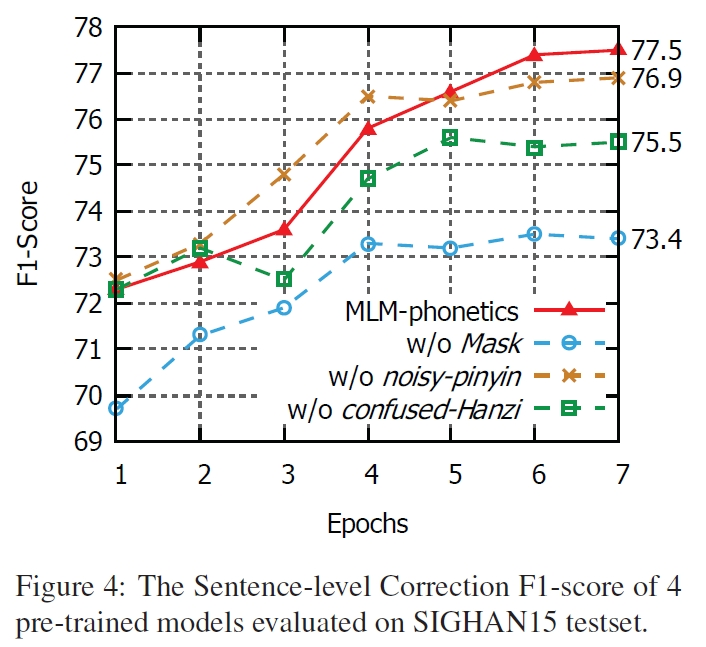

# 【2021 52】Correcting Chinese Spelling Errors with Phonetic Pre-training

[(ACL论文)](https://aclanthology.org/2021.findings-acl.198.pdf) [(PDF)](D:\learning\论文\GEC\【2021 52】Correcting Chinese Spelling Errors with Phonetic Pre-training.pdf) 

> 本文提出一个端到端的CSC模型，该模型通过预训练和微调将语音特征加入到语言模型中；此外，还优化了mask预训练方式，使用语音特征和形音字来替换文本中的字；并使用自适应权重目标函数将错误检测和错误纠正在一个统一的框架中进行联合训练。

## 以往工作存在的缺陷

- 过去工作仅使用语言模型，而使用语音特征进行纠错；或者仅将语音特征作为外部知识（未参与到训练中，不涉及梯度反向传播过程）

  - 语言模型被用于生成流畅的句子
  - 语音特征能把避免模型生成与原文本发音不一致的字

  

- 以往工作使用的是pipeline框架，即先检测通过语言模型先检测文本中的错误并生成候选纠正，再通过语音特征或规则对候选纠正就行过滤

## 解决的问题

- 优化mask预训练模式，使用pinyin或者形音字替换原始文本，并进行预训练
- 检错模块和纠错模块联合训练，其中纠错模块融合word embedding和pinyin embedding特征，将其作为输入；两个模块通过权重loss进行训练

## 方法

### 模型结构

#### 检错模块

- 作为序列标注任务，对输入文本的每一个字判断是否错误（01分类问题）

#### 纠错模块

- 基于检错模块的输出进行纠错
- 使用word embedding和pinyin embedding融合特征作为输入（使用权重进行融合）

> $p_{err}$表示某个字错误的概率
>
> 其中Encoder和$f_{crt}$有MLM-phonetics初始化得到

### 联合微调

- 使用检错loss和纠错loss联合训练：

### 预训练MLM-phonetics

- 训练时随机选择20%的token位置，如果位置$i$处的token被选择，那么：
  - 以40%的概率替换为[MASK]
  - 30%的概率替换为$noisy-pinyin$ 
  - 30%的概率替换为$confused-Hanzi$ 

## 实验结果

- sentence-level F1
- character-level F1

