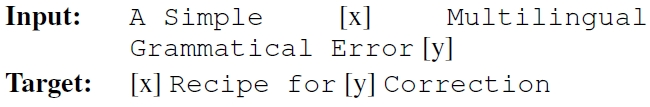
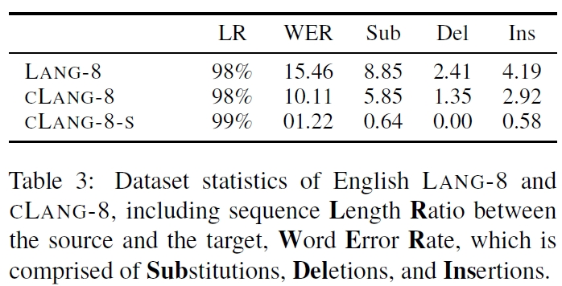

# 【2021 88】A Simple Recipe for Multilingual Grammatical Error Correction

[(arxiv)](https://arxiv.org/pdf/2106.03830.pdf) [(PDF)](D:\learning\论文\GEC\【2021 88】A simple recipe for multilingual grammatical error correction..pdf) 

> 本文提出了一种简单的训练多语言GEC模型的方法。首先提出一种语言不可知手段，来生成大量合成样本。然后使用大规模多语言模型（mT5）。并Lang-8语料库的数据进行清洗，发布了新的cLang-8数据集。

## 以往工作的缺陷

- Lang-8数据集存在较多错误；
- 尽管合成训练数据能提高GEC模型的准确度，但也存在一些问题：
  - 由于合成数据无法捕获目标评估集完整的错误分布，最终的模型需要通过经过**多阶段的微调**过程才能得到；
  - 为特定语言合成训练集需要针对不同语言的超参数和拼写词典等对合成方法进行单独的调整。
- 利用自监督的预训练和增加模型规模方法已经在许多Seq2Seq任务上取得了显著的改进，但这些方法在GEC上的应用程度却很有限。

## 解决的问题

- 展示了当模型规模扩大时，一个简单的语言不可知预训练目标能在GEC任务上实现SOTA;
- 展示了模型大小对GEC效果的影响；
- 发布了一个基于Lang-8的大型多语言GEC数据集cLang-8，它允许**不需要额外的微调步骤**就能得到最先进的GEC结果，从而大大简化了模型的训练。

## 方法

### 所用模型

- mT5（T5的多语言版本）
- mT5在mC4语料库上进行过预训练，该模型最初的预训练目标为span prediction：

### GEC预训练

- mT5训练的是段落，而不是句子，所以将mC4语料库中的所有段落分割为句子，并使用以下方法构建语法不规则的数据（保留了2%语法规则的句子）：

​	（1）删除字词片段

​	（2）交换字词位置

​	（3）删除字符片段

​	（4）交换字符位置

​	（5）插入字符

​	（6）单词小写

​	（7）大写单词的第一个字符

- 使用以下三种方法进行训练，(c)效果最好

  （a）将GEC预训练数据（3.2所示）与微调数据集混合（如本文四所示）混合

  （b）混合预训练和微调的例子，但用不同的前缀对它们进行注释

  （c）首先使用GEC预训练，直到收敛，然后进行微调。

### cLang数据集

- 对Lang-8数据集进行了两种清洗方法：
  - 构建clang-8：为Lang-8生成了新的目标语句，而不考虑原始的目标语句。尝试使用非监督模型（使用GEC预训练目标和监督模型（gT5 xxl）进行训练）。
  - 构建cLang-8-s：使用无监督模型和监督模型对源目标语句进行评分，忽略最低评分20%、50%、70%或90%的目标语句。忽略50%是最好的设置。

