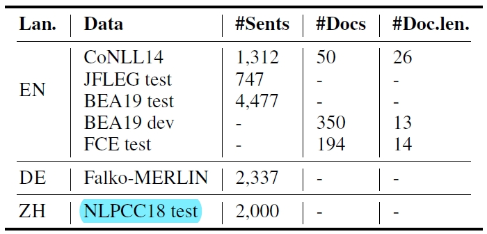
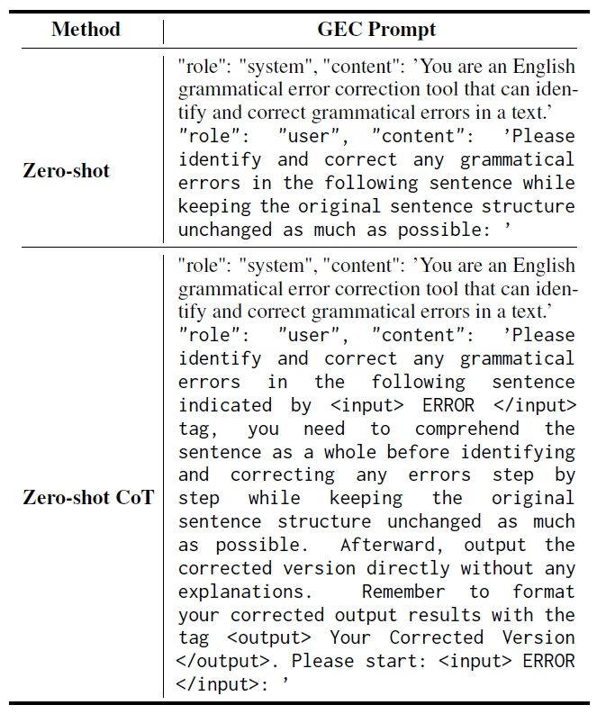
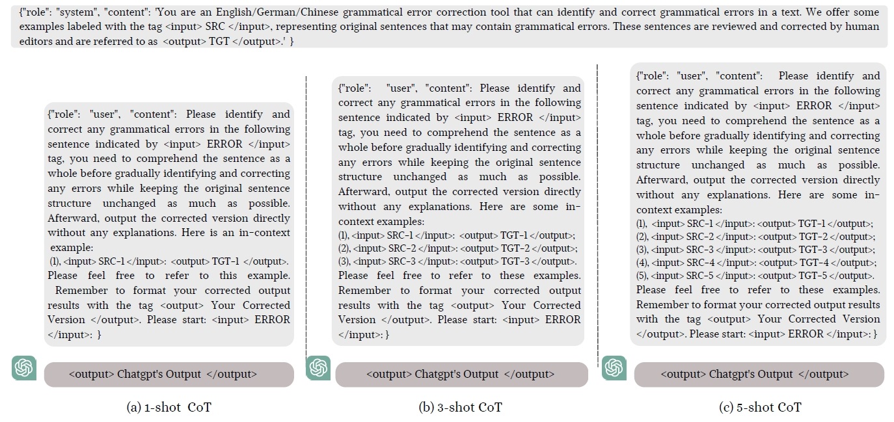
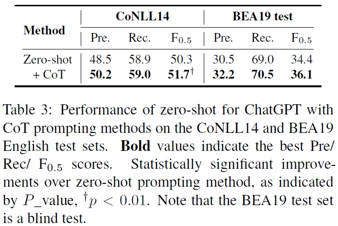
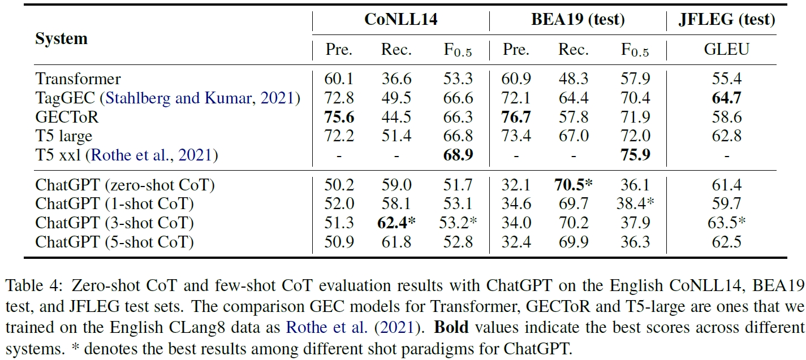
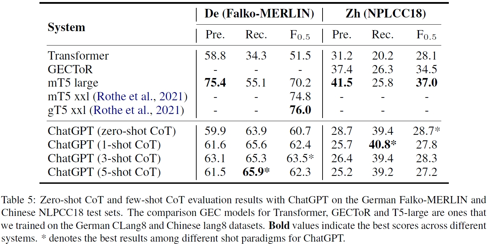
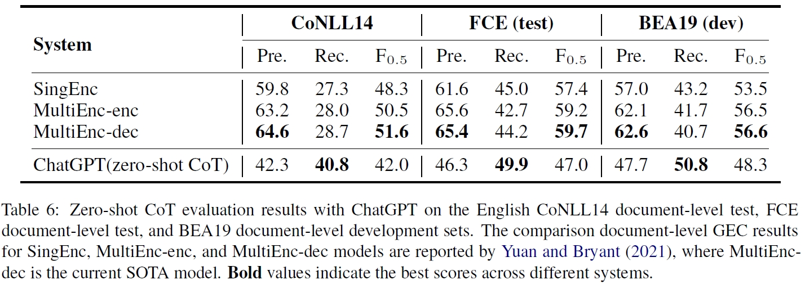

# 【2023 22】Is ChatGPT a Highly Fluent Grammatical Error Correction System? A Comprehensive Evaluation

> 本文对ChatGPT在语法纠错任务上的表现进行了测试，使用zero-shot chain-of-thought以及上下文学习的few-shot方法对其进行了评估（sentence-leve和document-level）。实验表明，ChatGPT在英语以及其它语言的GEC任务上表现较好，但在document-level任务上，ChatGPT不能有效解决以下几种类型的错误：**句子一致性**、**共指**、**时态错误**和**跨句子边界错误**。

[(arxiv)](https://arxiv.org/pdf/2304.01746.pdf) [(PDF)](D:\learning\论文\GEC\【2023】Is ChatGPT a Highly Fluent Grammatical Error Correction System.pdf) 

## 以往工作存在的缺陷

- ChatGPT在多种NLP任务上表现出较好的性能，但对其在GEC任务上的能力表现，缺乏一个广泛且深入的研究。

## 解决的问题

- 在sentence-level和document-level的GEC任务上，对ChatGPT表现进行了研究；
- 使用zero-shot CoT以及few-shot（1-shot、3-shot、5-shot）对ChatGPT进行了测试。

## 方法

### 数据集

### 模型

- [T5 and its variant models](https://arxiv.org/pdf/2106.03830.pdf)
- [GECToR model](https://arxiv.org/pdf/2005.12592.pdf)
- [TagGEC](https://arxiv.org/pdf/2105.13318.pdf)
- [MultiEnc-dec model](https://aclanthology.org/2021.bea-1.8.pdf)

### 评价指标

- [M2 Scorer](https://github.com/nusnlp/m2scorer) （CoNLL14 English, Falko-MERLIN German, and NLPCC18 Chinese）
- [ERRANT Scorer](https://github.com/chrisjbryant/errant) （BEA2019 test set）

### 方法

#### zero-shot

#### few-shot

### 结果

#### zero-shot

#### zero-shot  CoT and few-shot  CoT

#### document-level

