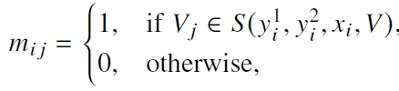

# 【2023 2】Progressive Multi-task Learning Framework for Chinese Text Error Correction

> 本文提出了一个model-agnostic的多任务学习框架：error detection、error type identification、correction result generation。该框架可以用于CSC和CTEC任务。

[(arxiv)](https://arxiv.org/pdf/2306.17447v1.pdf) [(PDF)](D:\learning\论文\GEC\【2023 2】Progressive Multi-task Learning Framework for Chinese Text Error Correction.pdf) 

## 以往工作的缺陷

- 以往工作存在over-correction和under-correction的问题，尤其是over-correction问题在CTEC任务中尤其明显

## 解决的问题

- 提出多任务学习框架，缓解over-correction问题

## 方法

### 模型结构

### Error Detection

- 二分类问题，Encoder后接线性层做预测

### Error Type Identification

- 多分类问题，将上层module预测的结果输入到线性层，对错误结果进行类型预测

- CEGC任务：三分类问题
  - 增删改（ADR）
- CSC任务：二分类问题
  - 形音字——Phonological Error(P)
  - 形近字——Morphological error (M)

### Correctin Result Generation

- Seq2Tag

  - 使用mask矩阵从混淆集取候选词

  

- Seq2Seq

  - 由于输入序列和输出序列长度不同，来自上个模块输出的错误类型需要进行对齐

