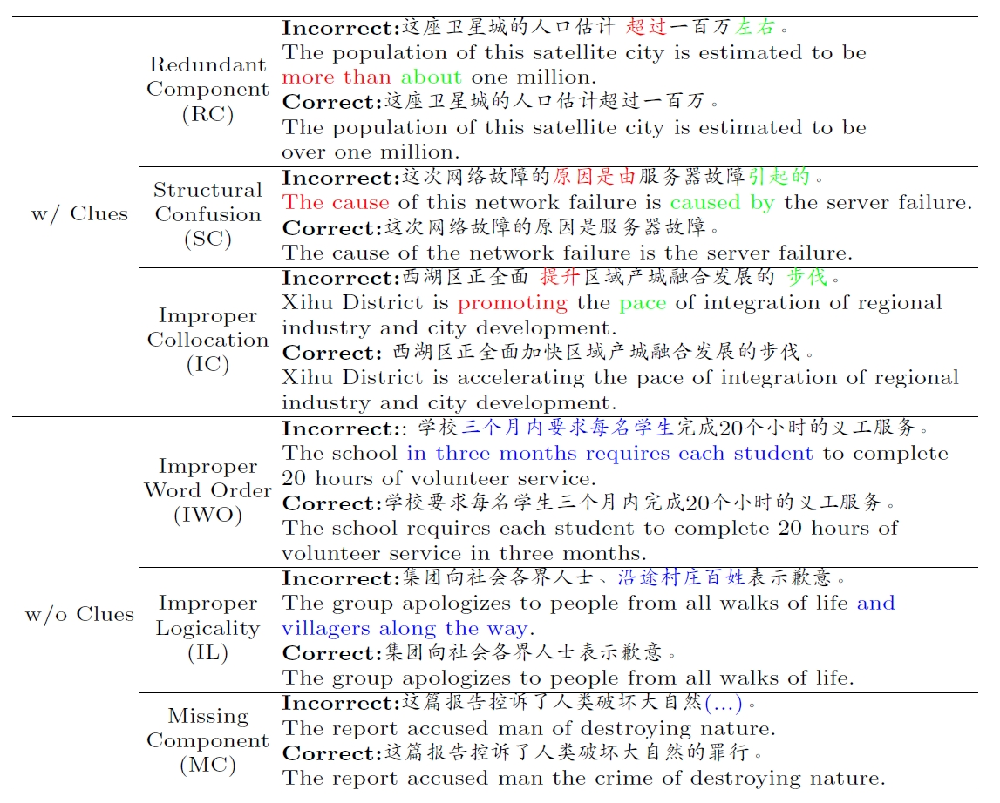
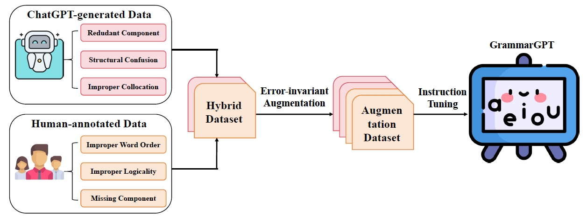
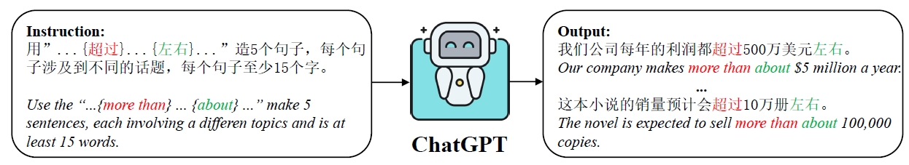
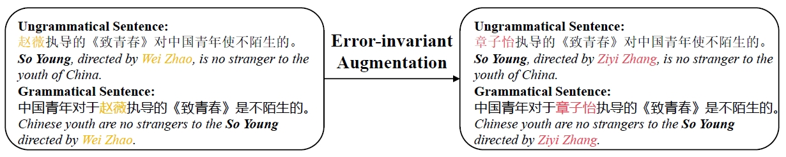

# 【2023】GrammarGPT: Exploring Open-Source LLMs for Native Chinese Grammatical Error Correction with Supervised Fine-Tuning

[(arxiv)](https://arxiv.org/pdf/2307.13923.pdf) [(PDF)](D:\learning\论文\GEC\【2023】GrammarGPT.pdf) [(code)](https://github.com/FreedomIntelligence/GrammarGPT) 

> 本文提出了一个混合数据集，其中包含ChatGPT生成的数据以及人工标注的数据。使用开源LLM在该数据集上进行指令微调，并进行了中文语法纠错。与SOTA相比，该工作使用的数据集更小，仅为SOTA使用数据集的$\frac{1}{1200}$。

## 以往工作的缺陷

- 以往工作已经证明闭源大模型在中文纠错的不错性能，但对开源大模型的探索还较少。

## 解决的问题

- 探索开源LLM在中文语法纠错的能力。
- 提出混合数据集，其中包括ChatGPT生成以及人工标注的数据。
- 使用了error-invariant增强方法，增加模型的纠错能力。

## 方法

### 错误类型

主要包含error with clues以及error without clues两种错误。

- error with clues：包括冗余、结构混淆、不合理搭配等。**较容易**被模型发现并纠正。
- error without clues：包括不合理词序、不合理逻辑、确实内容等。这种类型的错误语序通常较为通顺，**不容易**被模型发现并纠正。

### 系统框架

#### ChatGPT生成的数据

通过指令的方式让ChatGPT生成语法不规则的数据。

#### error-invariant增强方法

类似于槽位填充中的数据增强方法，主要是替换句子中的**实体名称**。

