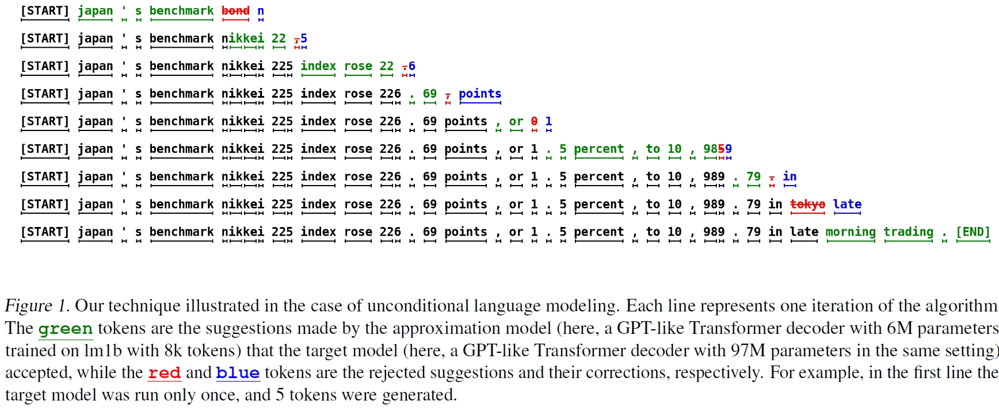

# 【2023 12】Fast Inference from Transformers via Speculative Decoding

[(ICML)]([leviathan23a.pdf (mlr.press)](https://proceedings.mlr.press/v202/leviathan23a/leviathan23a.pdf)) [(PDF)](D:\learning\论文\大模型\【2023 12】Fast Inference from Transformers via Speculative Decoding.pdf) [(知乎)](https://zhuanlan.zhihu.com/p/651359908)

> 本文提出了一种投机采样方法（speculative decoding），在不改变输出分布的情况下，可以从自回归模型中更快的采样。该方法的核心是：（1）大模型通常包含更加简单的子任务，而这些子任务可以被更有效率的模型（approximation model）进行估计；（2）通过推测执行（speculative execution）和一种新的采样方法，可以通过在近似模型（approximation model）的输出上并行运行它们（token），从而更快地从大模型中进行精确解码。

## 以往工作的缺陷

- 以往的自回归模型在生成K个token时，需要运行模型K次；
- 虽然有较多工作对加快大模型推理进行研究，但这些研究往往需要更改模型结构、改变训练流程、重新训练模型或无法保持输出一致性。

## 解决的问题

- 在大模型解码时，先使用一个较小的模型进行初步推理，然后将生成的token送入大模型进行评估，大模型接受的token则不需要重复生成，大模型拒绝的token则由大模型重新生成（采样）；
- 该方法不改变模型结构、训练流程、无需重复训练模型并能保持与自回归大模型输出一致的效果。

## 方法

- ### Speculative Decoding

  

  - #### overview

    1. 使用更效率的小模型$M_q$生成$\gamma$个token（$\gamma$为超参数）；
    2. 使用大模型$M_p$对小模型生成的token进行评估，如果全部接受的会导致二者生成的token为相同的分布；
    3. 如果某个token被大模型拒绝，则从一个调整分布（adjusted distribution）中对该token进行采样，从而进行修正。

  - #### Standardized Sampling

    - 常用的采样方法（argmax, top-k, nucleus, and setting a temperature）都可以被视为从一个调整的概率分布中进行标准采样，比如，argmax等价于**将分布的非max元素归零并进行规范化**。因此可以只处理概率分布的标准采样。

  - #### Speculative Sampling

    1. 如果大模型生成token的概率$p(x)$大于小模型生成token的概率$q(x)$，则认为大模型的对生成token更有把握，因此保留；
    2. 当$q(x)>p(x)$时，大模型以概率$1-\frac{p(x)}{q(x)}$拒绝该token的生成，并从调整概率分布$p'(x)=norm(max(0,p(x)-q(x)))$再次采样该token。

    

## 效果

> CPU time 指的是计算机处理器在执行一个特定程序时花费的时间，也就是程序在处理器上实际运行的时间。
>
> Clock time（也称为 wall time 或 real time）指的是程序从开始执行到结束所花费的时间，包括了等待资源、I/O 操作等等与 CPU 时间无关的时间。
>
> Real time（也称为 wall time 或 clock time）指的是从开始执行程序到程序完成所花费的时间，包括了 CPU 时间和与 CPU 时间无关的时间。
>
> Wall time（也称为 clock time 或 real time）和 Real time 意义相同，都是指程序从开始执行到结束所花费的时间，包括了 CPU 时间和与 CPU 时间无关的时间。