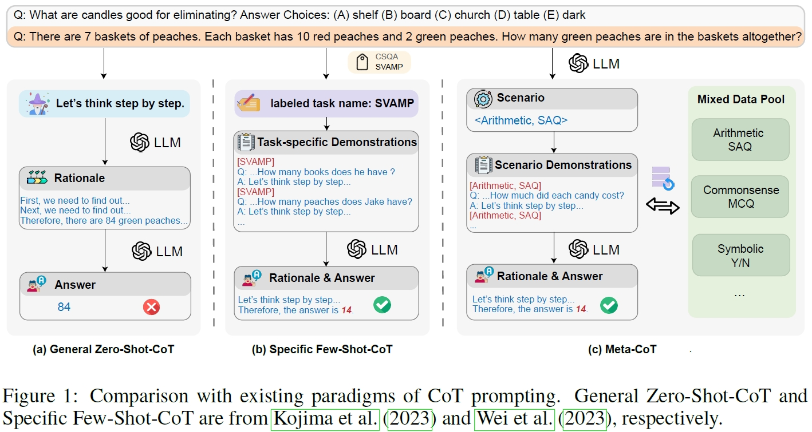
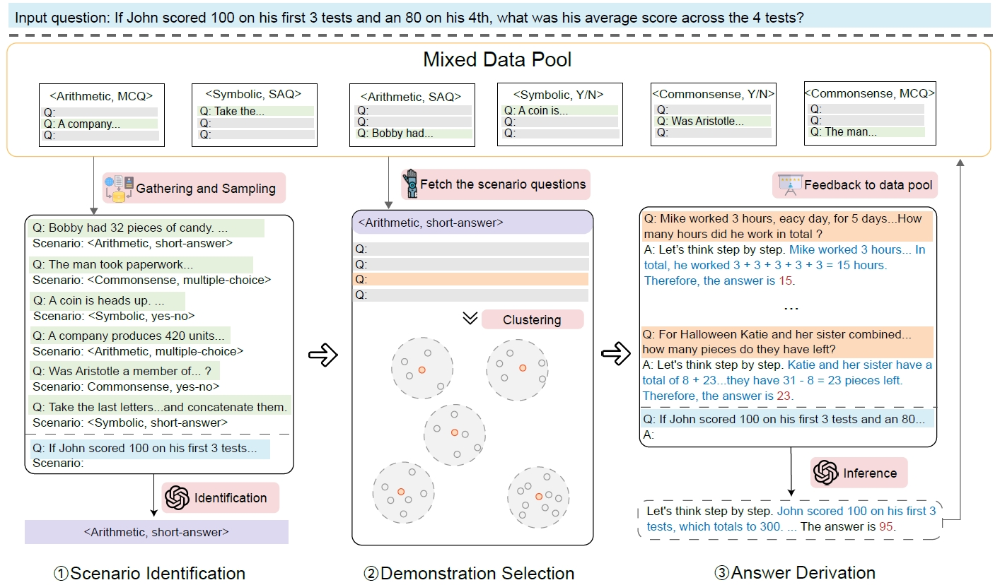

# 【2023】Meta-CoT Generalizable Chain-of-Thought Prompting in Mixed-task Scenarios with Large Language Models

[(arxiv)](https://arxiv.org/pdf/2310.06692.pdf) [(PDF)](‪D:\learning\论文\大模型\【2023】Meta-CoT Generalizable Chain-of-Thought Prompting in Mixed-task Scenarios with Large Language Models.pdf) [(code)](https://github.com/Anni-Zou/Meta-CoT) 

> 本文提出了一个可泛化的CoT（chain-of-thought）prompting方法，该方法使得大模型在输入问题类型未知的多任务场景下获得较好的性能，并且不需要额外的工程辅助方法。

## 以往工作的缺陷

- General Zero-Shot-CoT
  - 该模式不需要任何与具体任务相关的样本范例，因此泛化性较好；
  - 但与few-shot模式相比，zero-shot的性能较差。
- Specific Few-Shot-CoT
  - 严重依赖于任务相关的说明（demonstrations）以获得更好地性能，因此泛化性较差。
- 在实际应用中，LLM会遇到多类型问题，在该场景下，LLM不能清晰地分辨出问题属于哪个任务。在该场景下，人工创作几个与任务相关的示例既不合理，也不可能手动搜索它所指的任务。
- LLM在性能和泛化性之间还存在较大的gap。

## 解决的问题

> 使LLM既能有良好的泛化性，同时也有较好的性能。结合了zero-shot-CoT和few-shot-CoT的优势。

将输入问题进行场景分类，随后自动地从相应场景的数据池（data pool）中构建说明（demonstrations），最后将这些说明以及问题输入到LLM中生成答案。

## 方法

### 多任务场景的挑战

1. 划分混合问题
   - 采用了十个推理任务中的问题，这些问题包含三种类型：arithmetic, commonsense, symbolic reasoning；三种形式：short-answer, multiple-choice, and yes-or-no questions，并构建question-task对，将其作为上下文学习的demonstrations输入到LLM中；
   - 实验发现LLM不能很好地根据问题分辨出任务名称，但是可以较好地分辨出任务类型和形式；
   - 针对区分任务的三种形式进行了实验：category-based、form-based以及<Category, Form>，发现<Category, Form>效果最好。因此确定以**category and form**形式对混合问题进行划分。
2. 场景区分
   - LLM需要何种信息才能进行有效的场景区分？
   - 考虑输入到LLM的四种形式：
     - 仅包含问题 [Q]
     - 包含问题和答案 [Q, A]
     - 包含问题和思考 [Q, CoT]
     - 包含问题、思考和答案 [Q, CoT, A]
   - 实验发现LLM仅需要**Q**即可进行有效地场景区分。

### Meta-CoT

- 场景区分——判别问题类型
  - 基于<category，form>划分策略构建上下文学习说明；
  - 以上下文学习策略，引导大模型根据输入问题预测该问题的场景（类型）。
- demonstrations选择
  - 根据1中场景使用聚类方法构建few-shot demonstrations
- 答案生成
  - 经过2步骤可以得到$k$个与输入问题相同场景的demonstrations，以这$k$个demonstrations作为输入prompt模板，连同问题一起输入到大模型中，并生成答案。