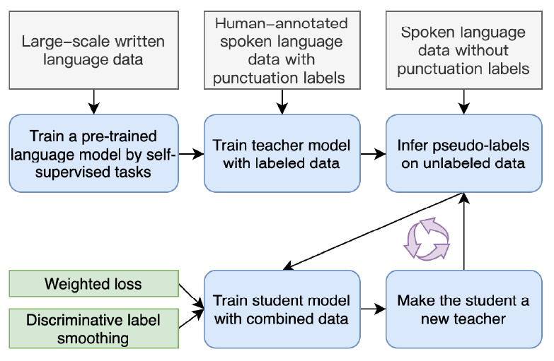
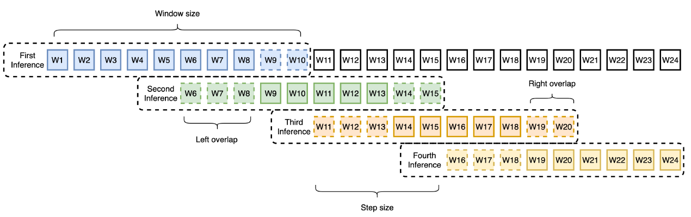

# 【2021  10】Discriminative Self-training for Punctuation Prediction

[(arxiv)](https://arxiv.org/pdf/2104.10339.pdf) [(PDF)](D:\learning\论文\标点预测/【2021】Discriminative self-training for punctuation prediction.pdf)

> 本文提出了discriminative Self-Training approach with weighted loss and discriminative label smoothing方法，可以使模型在训练中有效使用未标注的语音文本。

## 以往工作的缺陷

- 以往的标点恢复模型需要大量标注好的音频转录数据来进行训练。

## 解决的问题

- 提出了一种discriminative self-training方法，利用不带有标点符号的未标注音频转录文本进行训练。

## 方法

### 训练过程

- 使用有标注的标点文本训练一个teacher model（ce loss）
- 使用该模型对未标注文本生成pseudo label
- 使用标注数据和pseudo label数据训练一个student model，使用weighted loss，以及label smoothing
- 将训练好的student模型重新作为teacher模型

### Double-Overlap SlidingWindow Decoding Strategy

- 解决长文本截断情况下，截断文本开头和结尾标点预测不准的问题。