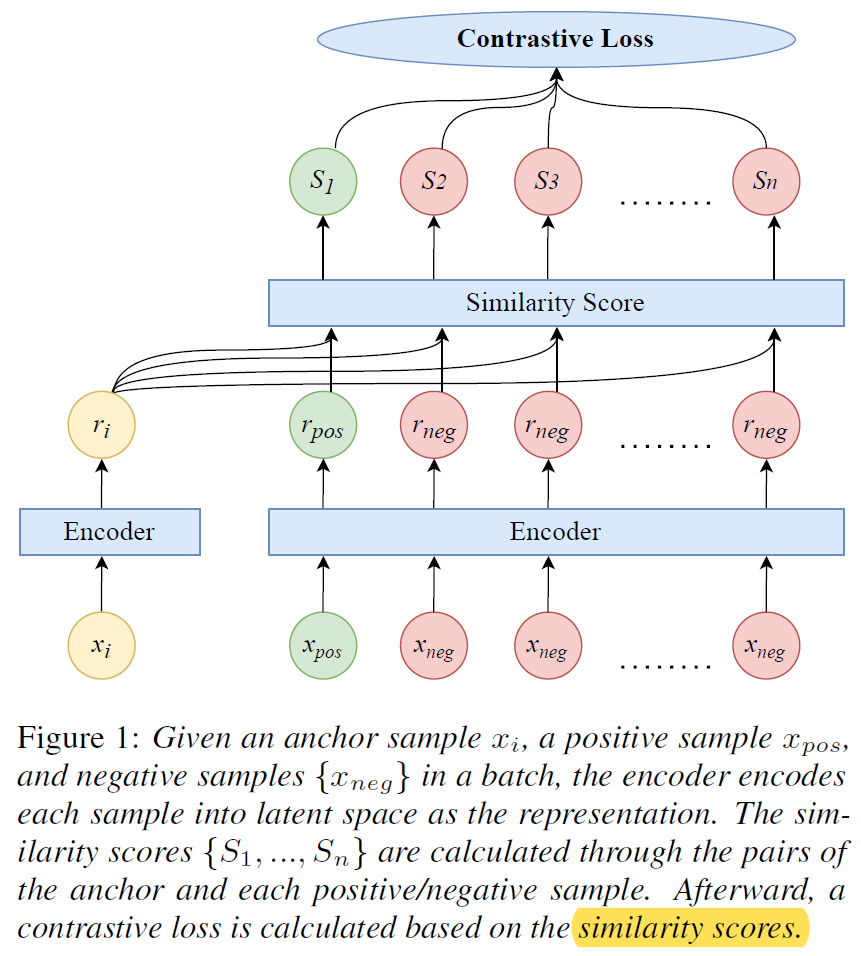
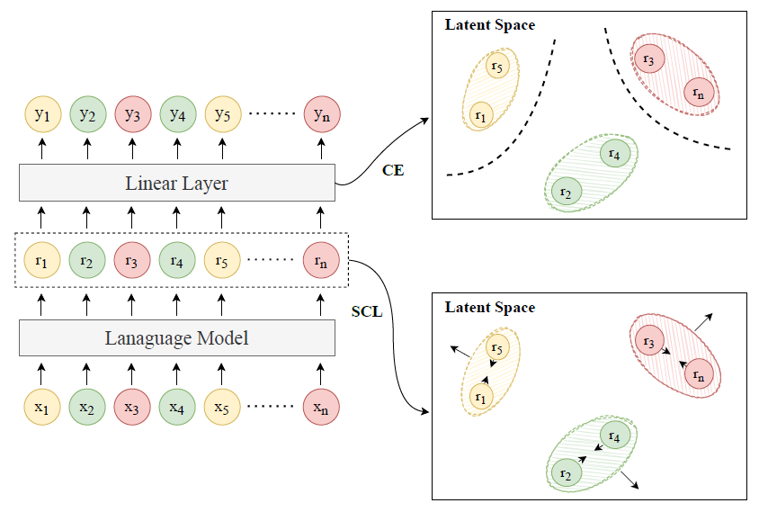
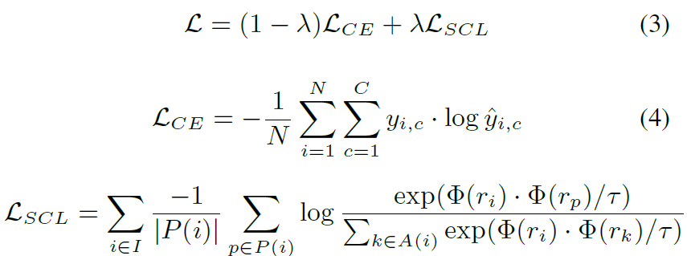

# 【2021  16】Token-Level Supervised Contrastive Learning for Punctuation Restoration

> 本文提出了一种token级别的监督对比学习方法，能最大化embedding空间内不同标点符号的表征距离。

[(arxiv)](https://arxiv.org/pdf/2107.09099.pdf) [(PDF)](D:\learning\论文\标点预测\【2021 15】Token-Level Supervised Contrastive Learning for Punctuation Restoration.pdf) [(code)](https://github.com/hqsiswiliam/punctuation-restoration-scl) 

## 以往工作的缺陷

- 以往的工作没有考虑**数据分布不平衡**的问题，比如数据集中某些类的标点较多，而另外的标点则较少。

## 解决的问题

> 对比学习在训练期间能利用所有类数据的信息，而不是仅利用那些来自相关类的数据。（同类数据相距近，不同类数据相距远）

## 方法

- 对比学习—[论文](https://proceedings.neurips.cc/paper/2020/file/d89a66c7c80a29b1bdbab0f2a1a94af8-Paper.pdf)      [SCL sentence](https://arxiv.org/pdf/2011.01403.pdf)

- 训练目标
  - 训练不同token的表征，使得它们对不同的标签都有不同的聚类空间
  - 对不同聚类簇构建边界，以便实现分类任务

​	训练时，使用CE和SCL loss同时进行训练。$\lambda$为超参数，论文实验结果较好的设置为0.1和0.6。

​	SCL使用了LM输出的embedding，而CE则使用了Linear输出的embedding。