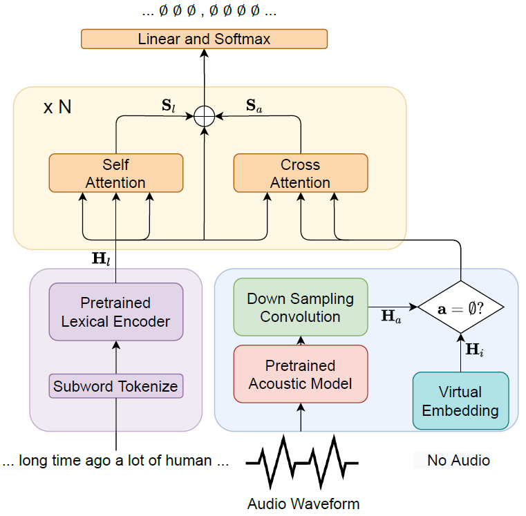

# 【2022  6】UNIFIED MULTIMODAL PUNCTUATION RESTORATION FRAMEWORK FOR MIXED-MODALITY CORPUS

[(arxiv)]([2202.00468.pdf (arxiv.org)](https://arxiv.org/pdf/2202.00468.pdf)) [(PDF)](D:\learning\论文\标点预测\【2022 ICASSP】Unified multimodal punctuation restoration framework for mixed-modality corpus.pdf) [(code)](https://github.com/Yaoming95/UniPunc) 

> 本文提出了一种多模态标点预测框架，能解决真实场景下，模态缺失的问题，如：文本和语音两种模态，但实际应用中并不是所有文本都有相对应的语音数据。

## 以往工作的缺陷：

- 过去的标点预测模型，使用的数据主要由两种：
  - 仅使用**文本数据**
  - **文本数据**以及其相应的**语音数据**

- 这种模型在真实应用中，会面临模态缺失问题，主要体现在两方面：
  - 由于内存限制或者隐私问题，导致并不是所有的文本数据都有其相应的语音数据
  - 人工标注语音数据非常昂贵

## 解决的问题：

> 一个好的标点预测多模态模型，应该在语音数据缺失的情况下仍能实现较好的效果，即当文本存在相应语音数据时，能同时利用两种数据；当文本不存在相应的语音数据时，也能较好的利用文本数据。

- 使用预训练的文本模型和声学模型，将两种模态转化为embedding
- 当文本存在对应的语音时，两种embedding同时作为模型的输入；当文本不存在对应的语音时，使用**virtual embedding**来模拟该文本的声学特征，并同时输入到模型中。

## 方法：

- 文本和音频（audio or virtual）经过预训练模型，其中音频经过了降采样。
- 文本embedding进行self-attention，并与音频embedding进行cross-attention
- $S_l$+$H_l$+$S_a$作为线性层的输入（残差连接）